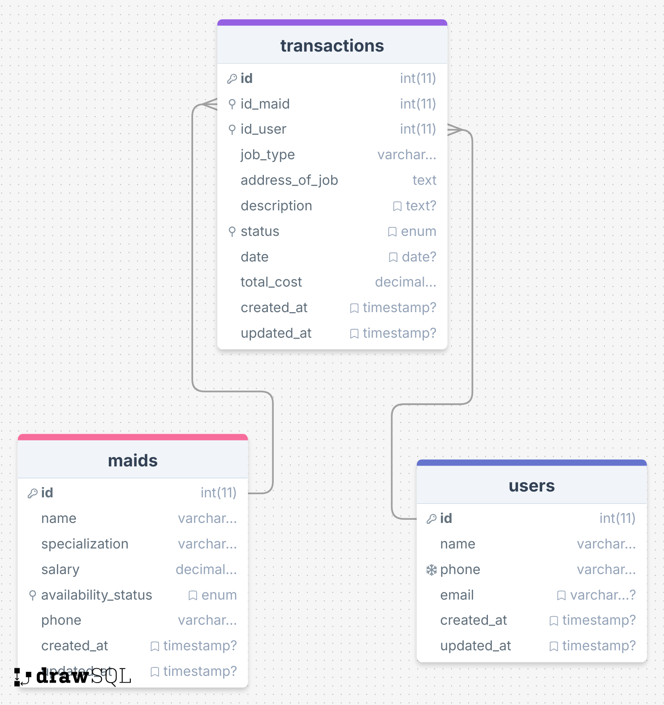

# TP7DPBO2025C2
Saya Zaki Adam dengan NIM 2304934 mengerjakan Tugas Praktikum 7 dalam mata kuliah Desain dan Pemrograman Berorientasi Objek untuk keberkahan-Nya maka saya tidak akan melakukan kecurangan seperti yang telah dispesifikasikan. Aamiin.

# Maid Service Management System

Sebuah aplikasi berbasis web modular menggunakan PHP untuk mengelola data maid, user, dan transaksi jasa layanan. Proyek ini dirancang dengan pendekatan OOP dan terstruktur menggunakan arsitektur terpisah antara *model*, *controller*, dan *view*.

---

## 🛠 Desain Program

### 1. Struktur Modular
Program terdiri atas modul utama:
- `maids.php` → Mengelola data maid
- `users.php` → Mengelola data pengguna
- `transactions.php` → Mengelola transaksi antara maid dan user
- `index.php` → Halaman utama (dashboard atau router)
- `class/` → Berisi file class PHP:
  - `Maid.php`
  - `User.php`
  - `Transaction.php`

### 2. Database
Struktur database diatur dalam `test.sql`, terdiri atas tiga tabel utama:
- `maids`: Menyimpan informasi maid seperti nama, spesialisasi, dan gaji.
- `users`: Menyimpan data pengguna jasa.
- `transactions`: Menyimpan riwayat pemesanan jasa maid oleh user.

### 3. Kelas OOP
Setiap entitas (`Maid`, `User`, `Transaction`) diwakili oleh sebuah class di folder `class/`, masing-masing memiliki:
- Atribut privat mewakili kolom database
- Konstruktor
- Fungsi untuk menampilkan atau memproses data

---

## 🔄 Penjelasan Alur Program

### 1. Inisialisasi
- `index.php` bertindak sebagai titik masuk utama.
- Berdasarkan parameter `$_GET` (misalnya `?page=maids`), akan diarahkan ke file modul terkait.

### 2. Pengelolaan Data
- Di setiap file seperti `maids.php`, objek `Maid` di-*instansiasi* untuk menampilkan, menambah, atau memodifikasi data maid.
- Demikian pula pada `users.php` dan `transactions.php`.

### 3. Transaksi
- Saat user memesan jasa maid, sistem mencatat transaksi melalui `transactions.php`.
- Data transaksi mencakup ID user, ID maid, tanggal pemesanan, dan status transaksi.

### 4. Penyimpanan
- Data disimpan dan diambil dari database MySQL menggunakan query SQL yang ditulis langsung atau melalui fungsi dalam class.

---

## 🧩 Dokumentasi

